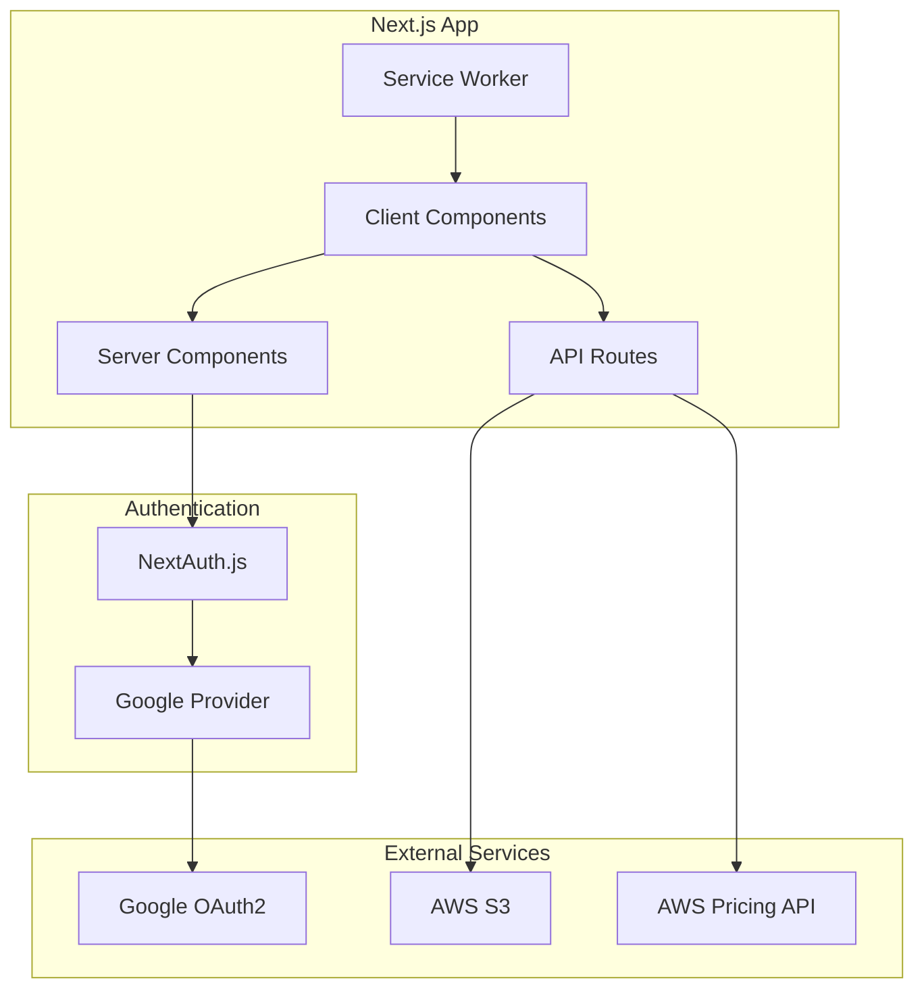

# Design Document

## Overview

The S3 File Manager Progressive Web App is a client-server application that enables users to authenticate with Google OAuth2 and manage file uploads to AWS S3 with cost optimization features. The system architecture emphasizes security, performance, and user experience while providing intelligent cost guidance for S3 operations.

## Architecture

### High-Level Architecture



### Technology Stack

**Full-Stack Framework:**
- Next.js 14+ with App Router for unified frontend/backend
- TypeScript for type safety across the stack
- Next.js PWA plugin for service worker management
- Progressive Web App manifest

**Authentication:**
- NextAuth.js v5 (Auth.js) with Google Provider
- Built-in OAuth2 handling with PKCE
- Secure session management

**File Handling & Cloud:**
- AWS SDK v3 for S3 operations
- Next.js API routes for serverless functions
- JSZip for archive creation
- React dropzone for file uploads

**Infrastructure:**
- Next.js serverless deployment (Vercel/AWS Lambda)
- Environment-based configuration (.env.local)
- Built-in API route protection with NextAuth.js
- Automatic HTTPS and security headers

## Components and Interfaces

### Authentication Component

**NextAuth.js Configuration**
```typescript
// Using NextAuth.js v5 with Google Provider
import { NextAuthConfig } from 'next-auth'
import Google from 'next-auth/providers/google'

export const authConfig: NextAuthConfig = {
  providers: [
    Google({
      clientId: process.env.GOOGLE_CLIENT_ID,
      clientSecret: process.env.GOOGLE_CLIENT_SECRET,
    })
  ],
  callbacks: {
    session: ({ session, token }) => ({
      ...session,
      user: {
        ...session.user,
        id: token.sub,
      },
    }),
    jwt: ({ token, user }) => {
      if (user) {
        token.sub = user.id
      }
      return token
    },
  },
}

interface UserSession {
  user: {
    id: string
    email: string
    name: string
    image: string
  }
  expires: string
}
```

### File Upload Component

**FileUploadService**
```typescript
interface FileUploadService {
  validateFiles(files: File[]): ValidationResult[]
  createArchive(files: File[], name: string): Promise<Blob>
  uploadFiles(files: File[], bucketName: string): Promise<UploadResult[]>
  uploadArchive(archive: Blob, bucketName: string): Promise<UploadResult>
}

interface UploadResult {
  success: boolean
  fileKey: string
  location: string
  size: number
  error?: string
}
```

### S3 Management Component

**S3ManagerService**
```typescript
interface S3ManagerService {
  createBucket(baseName: string, userId: string): Promise<string>
  listUserBuckets(userId: string): Promise<BucketInfo[]>
  listObjects(bucketName: string): Promise<ObjectInfo[]>
  generatePresignedUrl(bucketName: string, key: string): Promise<string>
  deleteBucket(bucketName: string): Promise<boolean>
}

interface BucketInfo {
  name: string
  creationDate: Date
  region: string
  objectCount?: number
}

interface ObjectInfo {
  key: string
  size: number
  lastModified: Date
  storageClass: string
  etag: string
}
```

### Cost Calculator Component

**CostCalculatorService**
```typescript
interface CostCalculatorService {
  calculateUploadCost(files: File[], method: 'individual' | 'zip'): Promise<CostEstimate>
  getStorageCost(totalSize: number, storageClass: string): Promise<number>
  getCurrentPricing(): Promise<PricingData>
}

interface CostEstimate {
  method: 'individual' | 'zip'
  storageCost: number
  requestCost: number
  transferCost: number
  totalCost: number
  savings?: number
}
```

## Data Models

### User Model
```typescript
interface User {
  id: string
  email: string
  googleId: string
  createdAt: Date
  lastLogin: Date
  awsCredentials?: {
    accessKeyId: string
    secretAccessKey: string
    region: string
  }
}
```

### Upload Session Model
```typescript
interface UploadSession {
  id: string
  userId: string
  bucketName: string
  files: {
    originalName: string
    key: string
    size: number
    mimeType: string
  }[]
  method: 'individual' | 'zip'
  status: 'pending' | 'uploading' | 'completed' | 'failed'
  createdAt: Date
  completedAt?: Date
  totalSize: number
  costEstimate: CostEstimate
}
```

### Bucket Management Model
```typescript
interface BucketMetadata {
  name: string
  userId: string
  displayName: string
  createdAt: Date
  lastAccessed?: Date
  totalSize: number
  objectCount: number
  lifecycleConfig?: {
    transitionToIA: number
    transitionToGlacier: number
    deleteAfter?: number
  }
}
```

## Error Handling

### Client-Side Error Handling
- Network connectivity errors with retry mechanisms
- File validation errors with user-friendly messages
- Authentication failures with re-login prompts
- Upload progress tracking with failure recovery

### Server-Side Error Handling
- AWS API error mapping to user-friendly messages
- Rate limiting with appropriate HTTP status codes
- Input validation with detailed error responses
- Logging and monitoring for debugging

### Error Response Format
```typescript
interface ErrorResponse {
  error: {
    code: string
    message: string
    details?: any
    timestamp: string
    requestId: string
  }
}
```

## Testing Strategy

### Unit Testing
- Component testing with React Testing Library
- Service layer testing with Jest
- AWS SDK mocking for S3 operations
- Authentication flow testing with mock providers

### Integration Testing
- API endpoint testing with supertest
- File upload workflow testing
- Cost calculation accuracy testing
- Bucket lifecycle management testing

### End-to-End Testing
- Complete user journey testing with Playwright
- PWA installation and offline functionality testing
- Cross-browser compatibility testing
- Mobile device responsive testing

### Performance Testing
- File upload performance benchmarking
- Concurrent user simulation
- Memory usage monitoring during large uploads
- Network bandwidth optimization validation

## Security Considerations

### Authentication Security
- OAuth2 PKCE flow implementation
- Secure token storage using httpOnly cookies
- Token refresh mechanism with rotation
- Session timeout and cleanup

### Data Security
- Client-side file encryption options
- Secure credential management via environment variables
- CORS policy configuration
- Input sanitization and validation

### AWS Security
- IAM role-based access control
- Bucket policy enforcement
- Server-side encryption (SSE-S3)
- Presigned URL expiration management

## Progressive Web App Features

### Installability
- Web app manifest with proper metadata
- Service worker registration
- Install prompt handling
- App icon and splash screen configuration

### Offline Functionality
- Service worker caching strategy
- Offline UI state management
- Background sync for pending uploads
- IndexedDB for offline data persistence

### Performance Optimization
- Code splitting and lazy loading
- Image optimization and compression
- Bundle size optimization
- CDN integration for static assets